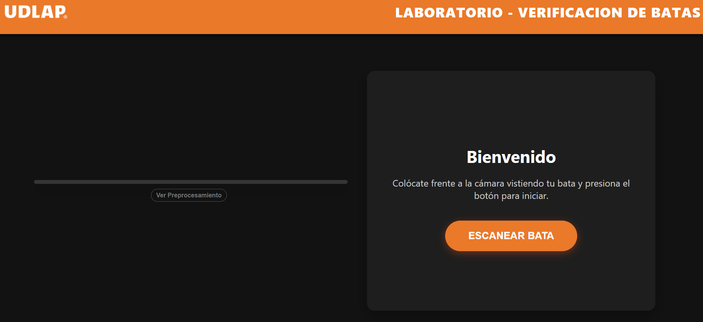
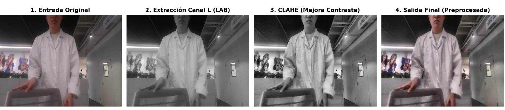

# 🛡️ BataCheck-UDLAP | Intelligent Lab Safety Monitor


> **Real-Time Personal Protective Equipment (PPE) Verification System with Hybrid Architecture.**

This project implements an intelligent security kiosk designed for the **Universidad de las Américas Puebla (UDLAP)** laboratories. It utilizes a **Cascade Architecture** that combines specific image processing techniques, **Deep Learning (YOLOv8)** for localization, and **Vision Transformers (ViT)** for feature validation, all optimized for local execution with minimal latency (<40ms).

---

## 🎯 Project Objective

The primary goal is to automate the enforcement of safety protocols within academic laboratories. By replacing manual inspections with an autonomous kiosk, the system ensures consistent compliance with PPE regulations—specifically lab coats—thereby streamlining student access and maintaining a secure working environment.

| System State | Visual Indicator | System Response |
| :--- | :--- | :--- |
| **Lab Coat Verified** | ✅ ACCESS GRANTED (Green) | Plays access confirmation sound and unlocks entry. |
| **No Coat / Incorrect** | ⚠️ SCANNING / ALERT | Keeps entry locked and prompts user for correction. |
| **False Positives** | 🛡️ AUTO-FILTERING | Geometric and spectral discrimination to ignore similar clothing (e.g., grey hoodies). |

---

## 🏗️ System Architecture & Technical Specifications

Unlike standard solutions relying solely on a neural network, **BataCheck** implements a robust **4-stage processing pipeline** (Cascade Model) to ensure reliability under variable lighting and "clothing camouflage."

### 1. Image Signal Processing (ISP) Pipeline
To guarantee robustness against difficult lighting (shadows/backlight), a targeted processing workflow was implemented in the **CIELAB Color Space**:
* **RGB $\to$ LAB Conversion:** Separates Luminance ($L^*$) from Chrominance ($a^*, b^*$). This prevents color distortion when adjusting contrast.
* **Adaptive Contrast (CLAHE):** Applied **only to the $L^*$ channel**. This maximizes local contrast, highlighting fabric textures (folds, buttons, lapels) which are critical features for distinguishing white lab coats from flat-colored clothing.
* **Noise Reduction:** A Gaussian Blur kernel $(3,3)$ is applied to minimize high-frequency sensor noise before inference.

### 2. Object Localization (SOTA Detector)
* **Model:** **YOLOv8n** (Nano version).
* **Backbone:** CSPDarknet53 (Cross Stage Partial Network) for efficient feature extraction.
* **Head:** Anchor-free detection head, which reduces computational overhead compared to anchor-based models.
* **Training:** Transfer Learning on COCO weights followed by Fine-Tuning with a curated custom dataset (535 images) using Mosaic Augmentation.

### 3. Feature Validation (Hybrid Stage)
A **Vision Transformer (ViT-Tiny)** is integrated into the inference loop as a secondary validator (Cascade Classifier).
* **Mechanism:** When the YOLO detector identifies a candidate bounding box, a Region of Interest (ROI) is cropped.
* **Validation:** The crop is passed through the ViT (`vit_tiny_patch16_224`) to analyze deep semantic features.
* **Justification:** This hybrid approach combines the spatial inference speed of CNNs with the global attention capabilities of Transformers, reducing False Positives.

### 4. Heuristic Logic & UX
* **Geometric Filtering:** Automatically rejects detections that are too small (<10%) or too large (>95%) relative to the frame, filtering out background noise or artifacts.
* **Temporal Persistence:** A state machine requires detection consistency over `N` consecutive frames (Time-window filtering) to prevent flickering and ensure a stable decision.
* **Frontend:** A Flask-based web interface uses Async Fetch API for real-time status updates without page reloading.

---

## 📸 Visual Demonstration

### User Interface (UX)
A clean design adapted to UDLAP's graphic identity.

<p align="center">
  
</p>

### Engineer Mode (Debug View)
The system allows real-time visualization of how the algorithm "sees" the image after the LAB + CLAHE filtering stage.

<p align="center">
  
</p>

---

## 📊 Performance Results

The final model (`best.pt`) significantly exceeded the goals set in the initial proposal:

| Metric | Initial Goal | Final Result | Status |
| :--- | :--- | :--- | :--- |
| **Precision (P)** | > 85% | **99.9%** | 🟢 Exceeded |
| **Recall (R)** | > 85% | **100%** | 🟢 Exceeded |
| **mAP50** | > 85% | **99.5%** | 🟢 Exceeded |
| **Latency** | < 200ms | **~35ms** | 🟢 Exceeded |

---

## 🛠️ Installation & Usage

This project is autonomous and requires no external APIs. All processing is performed locally.

### Prerequisites
* Python 3.10+
* Functional Webcam

### Steps

1. **Clone the repository:**
   ```bash
   git clone [https://github.com/JoniSrMonfil/BataCheck-UDLAP.git](https://github.com/JoniSrMonfil/BataCheck-UDLAP.git)
   cd BataCheck-UDLAP

2.  **Install dependencies:**

    ```bash
    pip install -r requirements.txt
    ```

3.  **Run the application:**

    ```bash
    python src/app.py
    ```

4.  **Access Dashboard:**
    Open your browser at `http://127.0.0.1:5000`

-----

## 📂 Project Structure

```text
BataCheck-UDLAP/
├── models/             # Trained weights (YOLOv8 best.pt)
├── src/
│   ├── app.py          # Flask Backend + Hybrid Logic (YOLO+ViT)
│   ├── static/         # Assets (CSS, JS, Logo, Sounds)
│   └── templates/      # Frontend (HTML)
├── requirements.txt    # Project dependencies
└── README.md           # Documentation
```

-----

## 👤 Author

**Jonathan Josmar Monfil Guevara** **Student ID:** 176128  
**Universidad de las Américas Puebla (UDLAP)**

-----